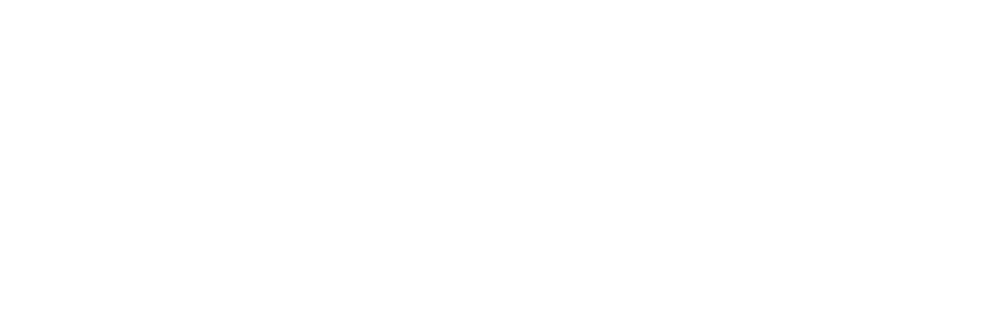

  

<h1 align="center">DeUnapp System</h1>

  Plataforma web para administrar envíos, operadores logísticos, rutas,
  pagos, recargas, incidencias y soporte.

  
  
  
  

[!IMPORTANT]
Este README documenta el entorno local de desarrollo. No publiques archivos
.env, claves de aplicación, tokens de Mapbox ni credenciales reales.

Contenido

Descripción

Funciones principales

Tecnologías

Estado técnico verificado

Requisitos

Instalación local

Configuración de Mapbox

Ejecución

Usuarios y permisos

Arquitectura

Estructura del proyecto

Base de datos

Pruebas

Solución de problemas

Seguridad

Documentación

Licencia

Descripción

DeUnapp System es una aplicación monolítica desarrollada con Laravel. Centraliza
la operación de entregas desde la creación de un envío hasta su finalización,
incluyendo la asignación de viajes, planificación de rutas, seguimiento,
evidencias de entrega, pagos, recargas y atención de incidencias.

La aplicación combina páginas renderizadas con Blade y endpoints JSON. Las
operaciones privadas usan autenticación por sesión, verificación de correo,
protección CSRF y autorización mediante Policies.

Funciones principales

Registro, inicio de sesión, verificación de correo y recuperación de contraseña.

Administración de clientes, proveedores, repartidores, vehículos y personal.

Creación, consulta, seguimiento y cancelación de envíos.

Registro de remitentes, destinatarios, direcciones y paquetes.

Asignación de servicios con viajes prepagados locales o intermunicipales.

Creación, activación, finalización y cancelación de rutas.

Registro de ubicaciones y visualización de recorridos con Mapbox.

Confirmación y reembolso de pagos.

Recargas, paquetes de viajes y movimientos de crédito o débito.

Evidencias de entrega, calificaciones, incidencias y tickets de soporte.

Notificaciones internas y registros de auditoría.

Tecnologías

Componente

Uso

PHP 8.2 o superior

Lenguaje del backend

Laravel 12

Framework web y reglas de aplicación

MySQL 8

Base de datos principal

Blade

Plantillas de la interfaz

Eloquent ORM

Modelos, relaciones y consultas

Vite 7

Compilación de recursos del frontend

Tailwind CSS 4

Estilos de la interfaz

Axios

Solicitudes HTTP desde JavaScript

Mapbox GL JS

Mapas, destinos y ubicación de repartidores

PHPUnit 11

Pruebas automatizadas

Estado técnico verificado

Resumen de la rama dev revisada en septiembre de 2026:

Elemento

Cantidad

Endpoints HTTP en routes/web.php

123

Migraciones

57

Tablas creadas por las migraciones

54

Modelos Eloquent

47

Form Requests

44

Policies

16

Services

43

Los endpoints se distribuyen en 66 solicitudes GET, 22 POST, 2 PUT y
33 PATCH. Estas cantidades describen la revisión indicada y deben actualizarse
cuando cambie la estructura del proyecto.

Requisitos

Antes de comenzar, instala y configura:

PHP 8.2 o superior con las extensiones requeridas por Laravel y MySQL.

Composer.

Node.js y npm.

MySQL 8.

Git.

Laragon, recomendado para el entorno local en Windows.

Un token público de Mapbox para utilizar los mapas.

Acceso autorizado al repositorio.

Comprueba las versiones disponibles:

php --version
composer --version
node --version
npm --version
git --version

Instalación local

1. Clonar el repositorio

Desde C:\laragon\www:

git clone https://github.com/Gkan23/deunapp_system.git
cd deunapp_system

2. Seleccionar la rama de desarrollo

git switch dev
git pull origin dev

3. Instalar las dependencias

composer install
npm ci

Utiliza npm install en lugar de npm ci solamente cuando necesites actualizar
el archivo package-lock.json.

4. Crear el archivo de entorno

En Windows:

copy .env.example .env

En Linux o macOS:

cp .env.example .env

Configura como mínimo los siguientes valores:

APP_NAME=DeUnapp
APP_ENV=local
APP_DEBUG=true
APP_URL=http://deunapp_system.test

DB_CONNECTION=mysql
DB_HOST=127.0.0.1
DB_PORT=3306
DB_DATABASE=deunapp_system
DB_USERNAME=root
DB_PASSWORD=

CACHE_STORE=file
MAPBOX_PUBLIC_TOKEN=

[!NOTE]
http://deunapp_system.test corresponde al dominio automático de Laragon.
Si ejecutas php artisan serve, utiliza la URL que muestre la terminal,
normalmente http://127.0.0.1:8000.

5. Generar la clave de la aplicación

php artisan key:generate

No reemplaces una clave válida en un entorno que ya contenga datos cifrados.

6. Crear la base de datos

Crea una base vacía desde HeidiSQL o ejecuta:

CREATE DATABASE deunapp_system
    CHARACTER SET utf8mb4
    COLLATE utf8mb4_unicode_ci;

El nombre debe coincidir exactamente con DB_DATABASE en .env.

Base de datos de pruebas

La suite utiliza una conexión MySQL independiente configurada en .env.testing.
Crea esa base antes de ejecutar las pruebas:

CREATE DATABASE deunapp_testing
    CHARACTER SET utf8mb4
    COLLATE utf8mb4_unicode_ci;

[!WARNING]
Nunca configures DB_DATABASE=deunapp_system en .env.testing. Las pruebas
deben permanecer aisladas de los datos de desarrollo.

7. Limpiar la configuración almacenada

php artisan optimize:clear

8. Ejecutar migraciones y Seeders

php artisan migrate --seed

Para reconstruir únicamente una base local cuyos datos puedan eliminarse:

php artisan migrate:fresh --seed

[!WARNING]
migrate:fresh elimina todas las tablas y los datos de la conexión activa.
Nunca lo ejecutes en producción ni en una base que debas conservar.

9. Compilar el frontend

npm run build

10. Ejecutar las pruebas

php artisan test

La instalación está lista si las migraciones, la compilación y las pruebas
terminan sin errores.

Configuración de Mapbox

Agrega un token público, cuyo prefijo debe ser pk., en el archivo .env:

MAPBOX_PUBLIC_TOKEN=pk...

Después de modificarlo, limpia la configuración:

php artisan optimize:clear

No almacenes tokens secretos ni tokens con permisos innecesarios en el
repositorio.

Ejecución

Con Laragon, abre:

http://deunapp_system.test

También puedes iniciar el servidor integrado de Laravel:

php artisan serve

Para observar cambios del frontend durante el desarrollo, utiliza otra terminal:

npm run dev

Usuarios y permisos

Rol

Responsabilidad principal

ADMINISTRATOR

Administra usuarios, roles, estados de cuenta y auditoría

CUSTOMER

Crea envíos, consulta seguimiento, solicita soporte y califica entregas

DELIVERY_PROVIDER

Administra repartidores, vehículos, rutas, recargas y viajes

COURIER

Ejecuta rutas y registra ubicaciones, entregas e intentos fallidos

SUPPORT_AGENT

Atiende tickets y gestiona incidencias autorizadas

Los estados de cuenta disponibles son PENDING, ACTIVE, SUSPENDED y
BLOCKED. Las Policies comprueban el rol, el estado de la cuenta y la relación
del usuario con el recurso. Algunas operaciones también exigen correo verificado.

Datos de demostración

DatabaseSeeder carga los catálogos y, cuando APP_ENV=local, crea las
siguientes cuentas verificadas y activas:

Rol

Correo

Administrador

administrador@deunapp.com

Cliente

cliente@deunapp.com

Proveedor

proveedor@deunapp.com

Repartidor

repartidor@deunapp.com

Soporte

soporte@deunapp.com

La contraseña común es:

DeUnapp123!

[!CAUTION]
Estas credenciales son públicas y deben existir únicamente en entornos
locales desechables. DemoUserSeeder no debe ejecutarse en producción.

DemoDataSeeder agrega un escenario funcional en local y testing, con un
envío, un servicio, viajes, una ruta planificada y un pago pendiente.

Arquitectura

flowchart LR
    A[Solicitud HTTP] --> B[Form Request]
    B --> C[Controller]
    C --> D[Policy]
    D --> E[Service]
    E --> F[Modelo Eloquent]
    F --> G[(MySQL)]
    C --> H[Blade o JSON]

Form Requests: validan y autorizan los datos de entrada.

Controllers: coordinan solicitudes y respuestas.

Policies: aplican permisos según usuario y recurso.

Services: concentran las reglas de negocio y las transacciones.

Models: representan las tablas y relaciones mediante Eloquent.

Observers: reaccionan a eventos de modelos y generan efectos controlados.

Las operaciones críticas utilizan transacciones y, cuando corresponde,
lockForUpdate() para reducir conflictos de concurrencia y estados parciales.

Estructura del proyecto

deunapp_system/
├── app/
│   ├── Http/
│   │   ├── Controllers/    # Entrada HTTP y respuestas
│   │   └── Requests/       # Autorización y validación
│   ├── Models/             # Entidades Eloquent
│   ├── Observers/          # Eventos de modelos
│   ├── Policies/           # Permisos por recurso
│   ├── Providers/          # Registro de servicios y Observers
│   └── Services/           # Reglas de negocio y transacciones
├── database/
│   ├── factories/          # Datos para pruebas y desarrollo
│   ├── migrations/         # Estructura de la base de datos
│   └── seeders/            # Catálogos y datos de demostración
├── resources/
│   ├── css/                # Estilos
│   ├── js/                 # JavaScript y mapas
│   └── views/              # Plantillas Blade
├── routes/
│   ├── web.php             # Páginas y endpoints JSON
│   └── console.php         # Comandos de consola
├── tests/                  # Pruebas Feature y Unit
├── composer.json
└── package.json

Base de datos

El modelo de datos se divide en los siguientes dominios:

Identidad, roles, estados de cuenta y perfiles.

Clientes, proveedores, repartidores y vehículos.

Municipios, direcciones y sucursales.

Envíos, paquetes, estados, historial y evidencias.

Servicios de entrega, viajes, rutas y paradas.

Pagos, recargas, comisiones y transacciones.

Incidencias, soporte, notificaciones y auditoría.

Tablas internas de Laravel para sesiones, caché, colas y contraseñas.

Las migraciones son la fuente de verdad de la estructura. Consulta el diagrama
entidad-relación de la carpeta docs/ para obtener una vista general.

Flujo principal del envío

stateDiagram-v2
    [*] --> REQUESTED
    REQUESTED --> PICKED_UP
    PICKED_UP --> IN_TRANSIT
    IN_TRANSIT --> OUT_FOR_DELIVERY
    OUT_FOR_DELIVERY --> DELIVERED
    REQUESTED --> CANCELLED
    PICKED_UP --> CANCELLED

Las transiciones definitivas dependen de las reglas implementadas por los
Services y no deben modificarse directamente en la base de datos.

Pruebas

Ejecuta la suite completa:

php artisan test

También puedes utilizar:

composer test

Para ejecutar una clase o caso específico:

php artisan test --filter=NombreDelTest

La suite cubre autenticación, autorización, validaciones, envíos, asignación de
viajes, rutas, entregas, pagos, recargas, soporte, auditoría, idempotencia e
integridad de la base de datos.

[!TIP]
La cantidad ejecutada puede variar por los conjuntos de datos de PHPUnit. La
salida de php artisan test es la evidencia vigente.

Solución de problemas

Laravel continúa usando SQLite o una configuración anterior

Confirma que trabajas en la copia correcta y revisa la configuración cargada:

cd C:\laragon\www\deunapp_system
type .env | findstr "APP_ENV APP_URL DB_CONNECTION DB_DATABASE CACHE_STORE"
php artisan optimize:clear

Si la suite de pruebas usa otra conexión, revisa también .env.testing y
phpunit.xml.

La URL de Vite aparece como localhost

Asegúrate de que APP_URL tenga el dominio local correcto y reinicia Vite:

APP_URL=http://deunapp_system.test

php artisan optimize:clear
npm run dev

Referencia de recarga duplicada al ejecutar Seeders

Si aparece una referencia como DEMO-RECHARGE-001, la base conserva datos de
demostración anteriores. En una base local desechable, reconstruye los datos:

php artisan migrate:fresh --seed

El mapa no carga

Comprueba que MAPBOX_PUBLIC_TOKEN contenga un token público válido, ejecuta
php artisan optimize:clear y vuelve a compilar el frontend.

Seguridad

Mantén .env fuera del control de versiones.

No publiques APP_KEY, contraseñas, tokens ni credenciales reales.

Conserva la autenticación por sesión y la protección CSRF en rutas privadas.

Autoriza operaciones mediante Policies, no solo desde la interfaz.

Valida la entrada con Form Requests.

Limita los datos de demostración a los entornos local y testing.

Revisa permisos y secretos antes de desplegar en otro entorno.

Si encuentras una vulnerabilidad, repórtala de manera privada al responsable del
repositorio. No publiques detalles explotables en un issue abierto.

Documentación

La documentación complementaria debe mantenerse en docs/:

Manual técnico de instalación.

Diagrama entidad-relación editable y exportado.

Capturas actualizadas de la interfaz.

Decisiones técnicas o procedimientos operativos que requieran más detalle.

Licencia

Este proyecto todavía no dispone de un archivo LICENSE. Que el repositorio
sea público no concede automáticamente permiso para copiar, modificar o
redistribuir su código.

[!IMPORTANT]
Antes de publicar la versión definitiva, alinea esta decisión con
composer.json, que actualmente declara la licencia MIT. Si se mantiene
MIT, agrega el archivo LICENSE; si aún no se ha elegido una licencia, corrige
ese campo para evitar información contradictoria.

Mantenimiento del README

Antes de publicar cambios importantes:

composer validate
php artisan route:list
php artisan test
npm run build
git diff --check

Actualiza este archivo cuando cambien los requisitos, las variables obligatorias,
el procedimiento de instalación, los roles o la arquitectura principal.

  Proyecto DeUnapp · Documentación técnica

